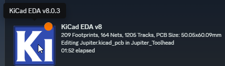

# KiCad-Discord-RPC
Discord Rich Presence for KiCad. Shows what you're working on in KiCad on Discord.

## You will need to manually install pypresence via the KiCad Command Prompt using "pip install pypresence"

## 